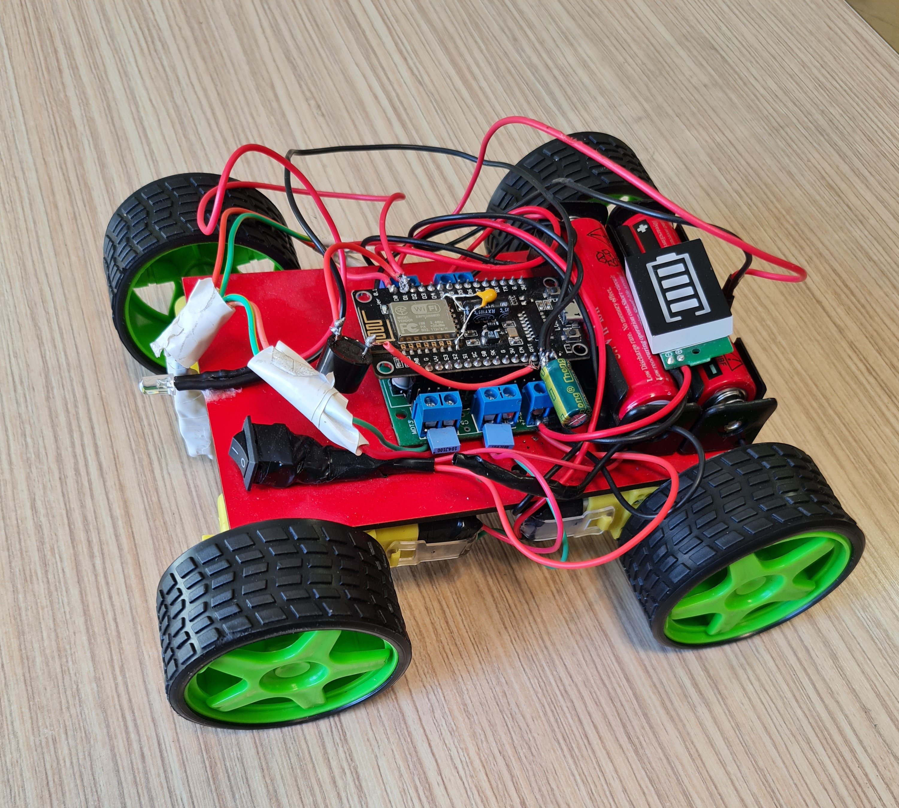
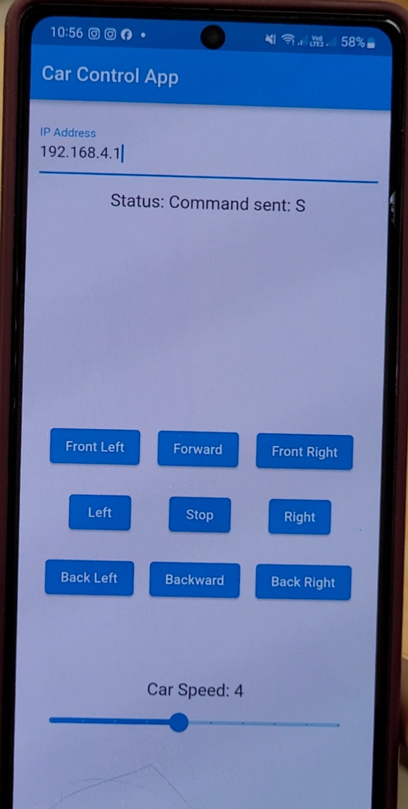

# NodeMCU WiFi Controlled Car App

This Flutter app allows remote control of a car using a NodeMCU-based WiFi module. The app provides a user interface for controlling the car's movement and speed over a WiFi connection.

*here is the Car*

*The android app menu*

*Car is moving around And it is controlled through the mobile app*

## Table of Contents
- [Project Overview](#project-overview)
- [Folder Structure](#folder-structure)
- [Usage](#usage)
- [Setup](#setup)
- [Screenshots](#screenshots)

## Project Overview

This project consists of a Flutter mobile app that communicates with a NodeMCU-based WiFi module, controlling a car's movement and speed. The Flutter app allows the user to input an IP address, control the car's movement using buttons, and adjust the car's speed using a slider.

## Folder Structure

- `Flutter_app/`: Contains the Dart code for the Flutter app.
- `INO_WIFI_CONTROLER/`: Contains the Ino Program for set up the NodeMCU board.
- `pic/`: Contains images illustrating how to set up the NodeMCU board.
- `Andoid App/`: Contains an Apk app that you can install on your android phone to control the car. 

## Usage

To use this project, follow these steps:

1. Clone the repository.
2. Open the project in a Flutter-supported development environment.
3. Build and run the Flutter app on your device or emulator.
4. Connect your NodeMCU-based WiFi module to the same network as your mobile device.
5. Enter the IP address of the NodeMCU module in the app.
6. Use the buttons to control the car's movement and the slider to adjust its speed.

## Setup

To set up the NodeMCU-based WiFi-controlled car:

1. Refer to the images in the `pic/` folder for guidance on connecting and setting up the NodeMCU board.
2. Follow the wiring and pin configurations specified in the NodeMCU code (`NodeMCU_WiFi_Car.ino`) to connect the NodeMCU to the motor driver and motors.
3. Upload the `NodeMCU_WiFi_Car.ino` sketch to the NodeMCU board using the Arduino IDE.

## Screenshots

For a visual guide on how to set up the NodeMCU board and use the app, refer to the images in the `pic/` folder.

Add screenshots here if available.

